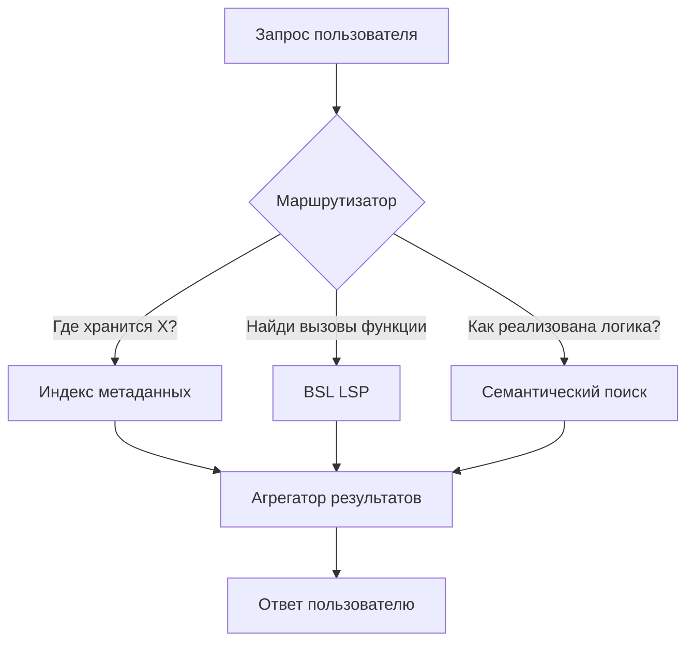

# Улучшение поисковой системы BSL MCP v2

## Проблема

Текущий семантический поиск не даёт релевантных результатов для типовых вопросов разработчика 1С:
- "Где хранится информация о клиентах?" → находит код с `&НаКлиенте` вместо справочника Контрагенты
- Нет понимания структуры метаданных 1С
- Нет интеграции с BSL LSP для точных запросов про символы

## Архитектура решения



---

## Конфигурация

### config.py

Новые параметры:
```python
BSL_LS_PATH: str = "C:\\Program Files\\bsl-language-server"  # Путь к BSL LS
BSL_LS_JAR: str = "bsl-language-server.jar"                  # Имя JAR файла
JAVA_PATH: str = "java"                                       # Путь к Java (или auto-detect)
```

### install.py

Добавить проверки при установке:
1. Проверить наличие Java Runtime
2. Проверить наличие `bsl-language-server.jar`
3. Предложить скачать/установить при отсутствии

---

## Компоненты

### Компонент 1: Маршрутизатор запросов

**Файл:** `code_search/search/query_router.py`

| Паттерн запроса | Стратегия | Инструмент |
|-----------------|-----------|------------|
| "где хранится", "какой справочник" | `metadata` | Индекс метаданных |
| "найди определение", "перейди к" | `lsp_definition` | BSL LSP |
| "кто вызывает", "где используется" | `lsp_references` | BSL LSP |
| "отформатируй", "format" | `lsp_format` | BSL LSP |
| "сложность", "метрики" | `lsp_metrics` | BSL LSP |
| "диагностики", "ошибки стиля" | `lsp_analyze` | BSL LSP |
| "как реализовано", "найди код" | `semantic` | Семантический поиск |

---

### Компонент 2: Индекс метаданных 1С

**Файл:** `code_search/indexer/metadata_index.py`

```python
@dataclass
class Metadata1CObject:
    object_type: str      # Catalog, Document, Register, Report
    name: str             # Контрагенты, Заказы
    synonym: str          # Из XML <Synonym>
    comment: str          # Комментарий объекта
    attributes: list[str] # Список реквизитов
    path: str             # Путь в выгрузке
```

---

### Компонент 3: Интеграция BSL LSP

**Файл:** `code_search/search/bsl_lsp_client.py`

Методы клиента:
- `find_definition(symbol)` — перейти к определению
- `find_references(symbol)` — найти использования
- `get_call_hierarchy(symbol)` — иерархия вызовов
- `get_document_symbols(file)` — список символов
- `analyze(path)` — диагностики
- `format(path)` — форматирование
- `get_complexity(symbol)` — метрики сложности

---

### Компонент 4: Улучшение семантического поиска

**Файл:** `code_search/indexer/engine.py`

Добавить в payload при индексации:
```python
payload = {
    "file_path": rel_path,
    "chunk": j,
    "object_type": "Catalog",      # NEW
    "object_name": "Контрагенты",  # NEW
}
```

---

## Фазы реализации

### Фаза 1: Улучшение семантического поиска
- [ ] Извлечение `object_type` и `object_name` из пути
- [ ] Улучшение сниппетов
- [ ] Фильтр директив компиляции

### Фаза 2: Индекс метаданных
- [ ] Парсер XML
- [ ] Хранение и поиск по метаданным

### Фаза 3: Маршрутизатор запросов
- [ ] Классификатор типа запроса
- [ ] Агрегация результатов

### Фаза 4: Интеграция BSL LSP
- [ ] Клиент BSL Language Server
- [ ] MCP инструменты для LSP функций
- [ ] Проверки в install.py

---

## Тестовые запросы

### BSL LSP запросы
| Запрос | Ожидание |
|--------|----------|
| «Покажи все места, где используется РасчитатьСкидку» | find references |
| «Перейди к определению ПолучитьТекущиеЦеныНоменклатуры» | go to definition |
| «Построй иерархию вызовов для ПровестиДокумент» | call hierarchy |
| «Покажи список процедур в текущем модуле» | document symbols |
| «Найди ошибки стиля в проекте» | analyze + diagnostics |
| «Оцени сложность метода ОбработатьПоступлениеТоваров» | metrics |

### Семантический поиск
| Запрос | Ожидание |
|--------|----------|
| «Где реализован расчёт бонусов менеджерам?» | Бизнес-логика бонусов |
| «Найди код возврата товаров покупателями» | End-to-end бизнес-процесс |
| «Как обрабатываются ошибки при обмене с API?» | Error handling паттерны |
| «Где проверяются права доступа при проведении?» | Логика авторизации |
| «Найди примеры интеграции HTTP/JSON» | Интеграции |
| «Где ограничения по скидкам?» | Валидации |
| «Код отчёта по задолженности клиентов» | Отчётная логика |

---

## Порядок реализации

Начинаю с **Фазы 1** → затем **Фаза 4** (BSL LSP) → потом Фазы 2-3.

> После Фазы 1 потребуется переиндексация баз для добавления `object_type`/`object_name` в payload.
