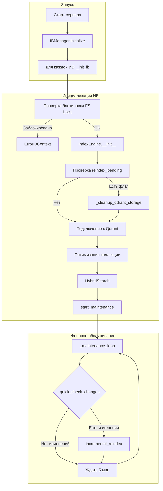
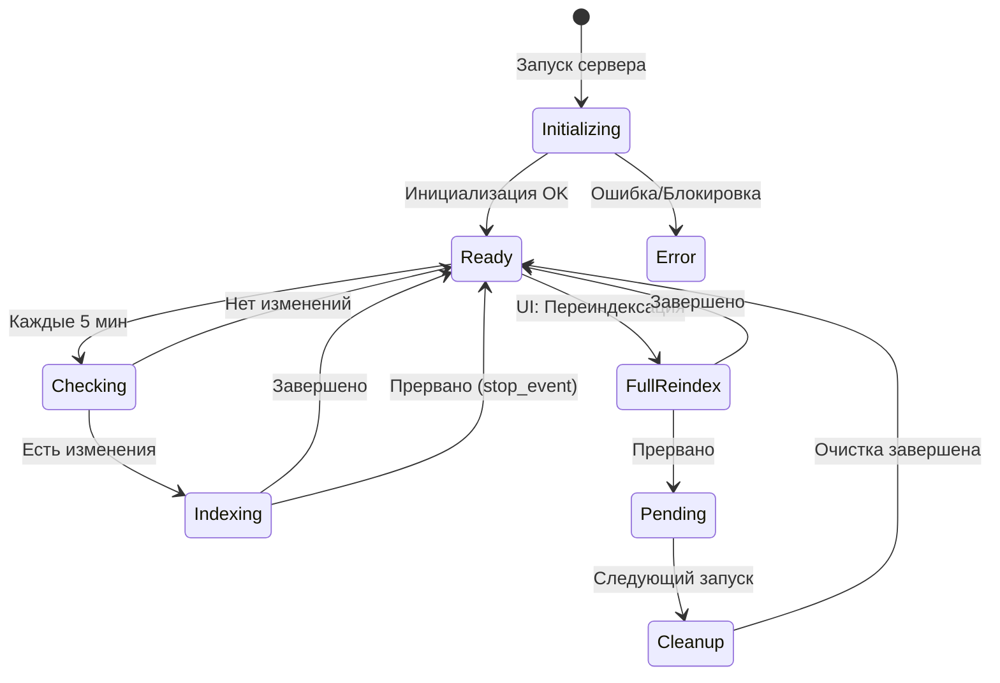

# Схема индексации

Документ описывает процесс индексации выгрузок 1С для семантического поиска.

## Общая архитектура



## Этапы запуска

### 1. Инициализация IndexEngine

При создании [IndexEngine](file:///c:/Users/rsyuzyov/repo/bsl-mcp/code_search/indexer/engine.py#L25-L72):

1. **Проверка флага `reindex_pending`** — если предыдущий reindex был прерван, очищаем БД
2. **Подключение к Qdrant** — создание клиента, warning если >5 сек
3. **Создание коллекции** — если не существует
4. **Оптимизация WAL** — сжатие сегментов при старте (если коллекция не пустая)

### 2. Запуск фонового обслуживания

[_maintenance_loop](file:///c:/Users/rsyuzyov/repo/bsl-mcp/code_search/app_context.py#L63-L87) — бесконечный цикл:

1. Проверка `quick_check_changes()` — быстрая проверка по mtime/size
2. Если есть изменения — запуск `incremental_reindex()`
3. Ожидание **5 минут** до следующей проверки

## Типы индексации

### Инкрементальная индексация

[incremental_reindex](file:///c:/Users/rsyuzyov/repo/bsl-mcp/code_search/indexer/engine.py#L411-L707) — запускается автоматически при обнаружении изменений:


**Этапы:**

| # | Этап | Описание |
|---|------|----------|
| 1 | Очистка сирот | Удаление чанков, чьи файлы отсутствуют в `file_hashes.json` |
| 2 | Проверка модели | Ожидание загрузки embedding-модели (до 120 сек) |
| 3 | Сканирование | Параллельное чтение файлов (`scan_workers` потоков) |
| 4 | Определение изменений | Сравнение hash/mtime/size с сохранёнными |
| 5 | Обработка | Для каждого изменённого файла: delete старых чанков → chunk → embed → upsert |
| 6 | Сохранение хэшей | После каждого батча (~500 чанков) сохраняем в `file_hashes.json` |
| 7 | Удаление | Удаление чанков для удалённых файлов |
| 8 | Оптимизация | Сжатие сегментов Qdrant |

### Полная переиндексация (Reindex)

[full_reindex](file:///c:/Users/rsyuzyov/repo/bsl-mcp/code_search/indexer/engine.py#L244-L408) — запускается вручную через UI:


**Особенности:**

- Создаётся флаг `reindex_pending` **до** очистки — если процесс прервётся, при следующем старте очистка завершится
- Коллекция полностью пересоздаётся через `clear_and_compact()`
- Все файлы обрабатываются заново

## Механизм отказоустойчивости

### Флаг reindex_pending

Файл `{index_dir}/reindex_pending` — маркер незавершённого reindex:

1. Создаётся в начале `full_reindex()`
2. Удаляется после успешной очистки БД
3. При старте сервера: если флаг есть — выполняется `_cleanup_qdrant_storage()`

### Инкрементальное сохранение хэшей

Хэши сохраняются **после каждого батча**, не в конце индексации. Это позволяет:

- При прерывании продолжить с места остановки
- Не терять прогресс при сбоях

## Структура данных

### file_hashes.json

```json
{
  "Catalogs\\Контрагенты\\Ext\\ObjectModule.bsl": {
    "hash": "d41d8cd98f00b204e9800998ecf8427e",
    "mtime": 133123456789012345,
    "size": 12345
  }
}
```

### Payload точки в Qdrant

```json
{
  "file_path": "Catalogs\\Контрагенты\\Ext\\ObjectModule.bsl",
  "chunk": 0,
  "object_type": "Справочник",
  "object_type_en": "Catalog",
  "object_name": "Контрагенты",
  "module_type": "ObjectModule",
  "func_name": "ПолучитьОстаткиТоваров",
  "line_number": 42,
  "is_function": true,
  "is_export": true,
  "text": "// Содержимое чанка..."
}
```

> **Примечание**: Поля `func_name`, `line_number`, `is_function`, `is_export` присутствуют только в режимах `methods` и `signatures`.

## Конфигурация

| Параметр | Значение | Описание |
|----------|----------|----------|
| `BATCH_SIZE` | 500 | Размер батча для upsert |
| `EMBED_BATCH_SIZE` | 64 | Размер батча для embedding |
| `scan_workers` | 4 | Потоки для параллельного чтения файлов |
| `embedding_mode` | full | Режим чанкирования: full/methods/signatures |
| Интервал проверки | 5 мин | Период между проверками изменений |

## Режимы эмбеддинга

См. подробную документацию: [embeddings_generate.md](embeddings_generate.md)

| Режим | Что индексируется | Размер индекса |
|-------|-------------------|----------------|
| `full` | Весь код файла | 100% |
| `methods` | Сигнатуры + комменты + превью тела | ~10-20% |
| `signatures` | Только сигнатуры + комменты | ~5% |

Режим задаётся в конфиге ИБ (`embedding_mode`) и через UI.

## Диаграмма состояний



## См. также

- [Режимы эмбеддинга](embeddings_generate.md) — full, methods, signatures
- [Qdrant Embedded](qdrant-embedded.md) — особенности работы с векторной БД
